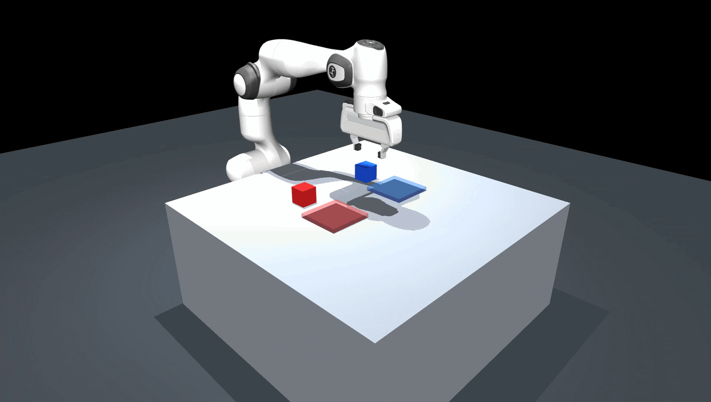

# MuJoCo Task-Embedding Pick and Place

This project tests whether a PPO policy can use a task embedding to place two cubes in the requested order.

## Simulation


## Setup

Requires Python 3.11.

```powershell
python -m venv .venv
.\.venv\Scripts\python.exe -m pip install -r requirements.txt
```

## Run

Train or play the PPO policy:

```powershell
.\.venv\Scripts\python.exe ppo.py --steps 3000000
.\.venv\Scripts\python.exe ppo.py --play
```

Record one high-quality 1080p, 50 FPS episode:

```powershell
.\.venv\Scripts\python.exe ppo.py --play --record recordings/simulation.mp4
```

Resume training:

```powershell
.\.venv\Scripts\python.exe ppo.py --steps 200000 --resume checkpoints/ppo_pick_place_v7.zip
```

## Task

The observation includes the requested cube order:

```text
[red first, blue first, red second, blue second]
```

PPO receives this embedding with the environment observation and learns the required placement sequence.
